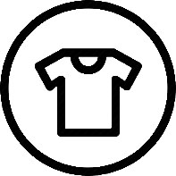

# http://simpleskies.github.io
FBLA 2020 Project
<!DOCTYPE html>
<html lang="en">
  <head>
    <meta charset="utf-8">
    <meta http-equiv="X-UA-Compatible" content="IE=edge">
    <meta name="viewport" content="width=device-width, initial-scale=1">
    <title>Airplane</title>
    <link href="CSS/bootstrap-4.0.0.css" rel="stylesheet">
	<link href="css/screen styles.css" rel="stylesheet" type="text/css" />
	<link href="css/background_scroll.css" rel="stylesheet" type="text/css" />
	<link href="css/main.css" rel="stylesheet" type="text/css" />
	<link href="css/animate.css" rel="stylesheet" type="text/css" />
	<link href="css/hover.css" rel="stylesheet" type="text/css" />
    
  </head>
  <body>
    <nav class="navbar navbar-expand-lg navbar-dark bg-dark">
      <button class="navbar-toggler" type="button" data-toggle="collapse" data-target="#navbarSupportedContent" aria-controls="navbarSupportedContent" aria-expanded="false" aria-label="Toggle navigation">
      
      </button>
      

        <ul class="navbar-nav mr-auto">
          <li class="nav-item active">
            <a class="nav-link slider_icon" href="index.html">Home (current)</a>
          </li>
          <li><a class="nav-link active slider_icon" href="flights.html">Flights</a> </li>
          <li class="nav-item dropdown slider_icon"><a class="nav-link active" href="frequent_flyer.html">Simple Savings</a>
          </li>
			<li class="nav-item slider_icon"> <a class="nav-link active" href="jobs.html">Jobs</a> </li>
			<li class="nav-item slider_icon"> <a class="nav-link active" href="reviews.html">Reviews</a> </li>
        </ul>
		  
        

		    
            
            
			
        

      

    </nav>
	  

	  

	   
	   
    

			
 

      
		 
 Simple &nbsp; &nbsp;    &nbsp; &nbsp;Skies   &nbsp;  

        
 

        

	

		 
	<section> </section>
	
Our website is colorless, so YOU can be colorful

	

      
Simple Skies is an affordable flight booking company dedicated to ensuring our customers can traverse the East Coast comfortably for both themselves and their bank accounts. Our prices are unmatched anywhere else!

      

    <section>
      

		   
        

			
          

			<a href="flights.html">  &nbsp;  &nbsp;</a>
            <ul class="list-unstyled">
              <li class="media">
              
                

                  <h5 class="mt-0 mb-1">Flights</h5>
                  
Choose from a selection of affordable, quality flights from as low as a $20 round trip

                

              </li>
            </ul>
          

          

			 <a href="frequent_flyer.html">   &nbsp;  &nbsp;</a>
		    <ul class="list-unstyled">
              <li class="media">
                

                  <h5 class="mt-0 mb-1">Simple Savings Club</h5>
                  
Check out our Frequent Flyer program and earn money back on each of your flights

                

              </li>
            </ul>
          

          

			  <a href="jobs.html">  &nbsp;  &nbsp;</a>
            <ul class="list-unstyled">
              <li class="media">
                
                

                  <h5 class="mt-0 mb-1">Jobs</h5>
                  
Love flying? Find out about career oppurtunities in our airliner family!

                

              </li>
            </ul>
          

        

      

    </section>
    

    <section>
      
 

    </section>
    

    

      

      <h3>Contact Us</h3>
          

          <address>
          <strong>Simple Skies</strong> 
6104 Franconia Station Ln  
Alexandria, VA 22310 
<abbr title="Phone">P:</abbr> (571) 456-7890  
<a href="mailto:#">SimpleSkies@gmail.com</a>
          </address>

      

    

		

 		
		 
    <footer class="text-center">
      

        

          

			 

            
©2020 CONNOR SCHICHTEL AND AYUSH JAIN

				 

			    
			

			
		    
            
            
			
        

			  
			  
			  
      

		  

		

    </footer>
    <!-- jQuery (necessary for Bootstrap's JavaScript plugins) -->
    
    <!-- Include all compiled plugins (below), or include individual files as needed -->
    
    
	  

  </body>
</html>
